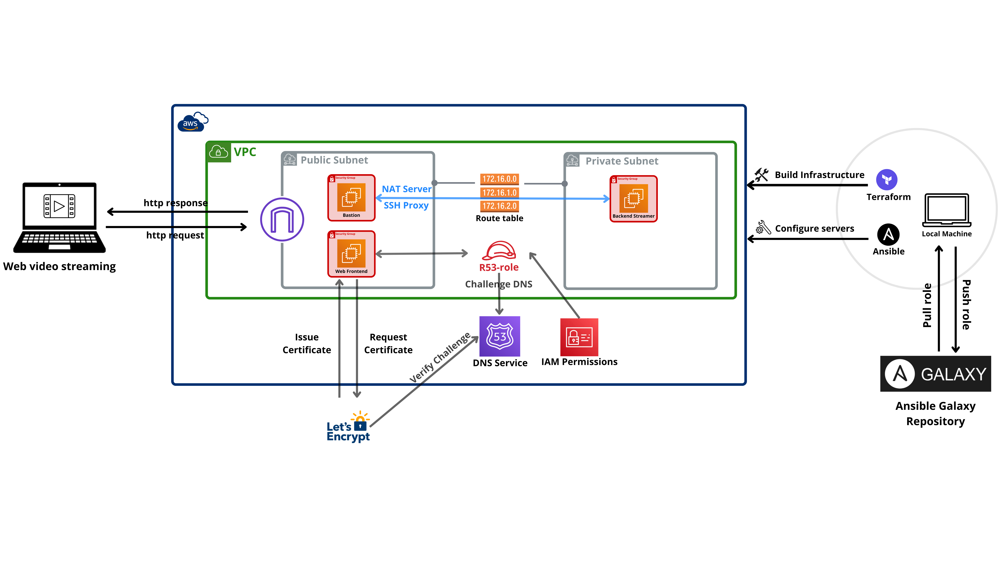

# AWS Video Streaming Service Automation
Refer to the [Getting started](#5--getting-started) section to deploy the service
 

**TABLE OF CONTENTS**
<!-- TOC depthFrom:2 -->
- [1- Introduction](#1--introduction)
- [2- Architecture](#2--architecture)
    - [2.1- Network architecture](#21--network-architecture)
    - [2.2- Instances and roles](#22--instances-and-roles)
        - [2.2.1- Frontend server](#221--frontend-server)
        - [2.2.2- Bastion server](#222--bastion-server)
        - [2.2.3- Backend streaming server](#222--backend-streaming-server)
- [3- Implementation details](#3--implementation-details)
    - [3.1- Infrastructure provisioning with terraform](#31--infrastructure-provisioning-with-terraform)
        - [3.1.1- Modular design](#311-modular-design)
        - [3.1.2- Infra module](#312-infra-module)
        - [3.1.3- Instance module](#312-infra-module)
        - [3.1.4- Inventory module](#312-infra-module)
    - [3.2- Server configuration with Ansible](#31--server-configuration-with-ansible)
        - [3.2.1- Dynamic inventory](#321--dynamic-inventory)
        - [3.2.2- Ansible roles](#322--ansible-roles)
        - [3.2.3- Nginx roles](#323--ansible-roles)
        - [3.2.4- SSL roles](#324--ansible-roles)
        - [3.2.5- Nat roles](#325--ansible-roles)
- [4- Security measures](#4--security-measures)
    - [4.1- Principle of least privilege](#41--principle-of-least-privilege)
    - [4.2- Isolation of backend server](#41--isolation-of-backend-server)
    - [4.3- Use of bastion server](#41--use-of-bastion-server)
    - [4.3- Data encryption with ssl](#41--data-encryption-with-ssl)
        (talk about route53)
- [5- Getting started](#5--getting-started)
    - [5.1- Building the infrastructure](#51--building-the-infrastructure)
    - [5.2- Configuring the servers](#51--configuring-the-servers)
    - [5.3- Testing the video streaming service](#53--testing-the-video-streaming-service)

<!-- /TOC -->
 

## 1- Introduction
This project aims to develop an automated environment for deploying a video streaming service on the AWS public cloud. This project is designed to provide a robust, scalable, and secure infrastructure for video streaming, leveraging the power of AWS services and automation tools such as Terraform and Ansible.

The infrastructure for the project consists of two subnets within the same Virtual Private Cloud (VPC): a public subnet and a private subnet. The public subnet hosts two critical instances: the frontend server, which runs an Nginx server to render video streams on the web, and the bastion server, which acts as a proxy for the backend streamer server. The backend streamer server, located in the private subnet, uses ffmpeg to stream video content to the frontend server and connects to the internet through the bastion server.

To ensure high availability and security, we use Amazon Route 53 to provide a domain name and Certbot to issue SSL certificates for secure HTTPS communication. The entire infrastructure setup is automated using Terraform, while Ansible is used for configuring all the servers. A strong emphasis is placed on security throughout the project, adhering to the principle of least privilege, isolating the backend server, and encrypting data transmissions with SSL.

This README will delve into the design, implementation, and security aspects of the project, highlighting its key features.

## 2- Architecture
### 2.1- Network architecture
Our infrastructure is hosted within a single VPC, which provides a logically isolated network in the AWS cloud. The VPC is configured with two subnets: a public subnet and a private subnet.  
**Public subnet**: This subnet is accessible from the internet and hosts the frontend server and the bastion server. The public subnet is designed to handle incoming and outgoing internet traffic through an AWS internet gateway, ensuring that the servers hosted in the VPC can interact with external clients and services.  
**Private subnet**: This subnet is isolated from direct internet access, providing an additional layer of security for sensitive operations. The private subnet hosts the backend streamer server, which handles the actual video streaming tasks. By isolating the backend server, we limit its exposure to potential external threats. However please note the following:  
- Even though the backend server is isolated, it can access the internet by using the bastion server as a nat server. all external traffic from the backend server is routed to the bastion server that routes it to the internet through the internet gateway.  
- To configure the backend server with ansible we need SSH access, this is ensured by using the bastion server as proxy, this will be further detailed when we talk about the [Ansible inventory](#321--dynamic-inventory).

### 2.2- Instances and roles
The network architecture involves three key instances, each with specific roles and responsibilities:
#### 2.2.1- Frontend server
The frontend server in our architecture plays a crucial role in delivering video content to end-users. It leverages Nginx to handle two main types of servers: the RTMP (Real-Time Messaging Protocol) server and the HTTP server. Each server has specific functions to ensure seamless video streaming and delivery.

**RTMP Server**:  
The RTMP server listens for incoming video streams from the backend server, which uses ffmpeg to push the video content. The RTMP server then processes and forwards these streams for further distribution.  
**HTTP Server**:  
 The HTTP server delivers the video content to end-users over the web. It provides a user-friendly interface for accessing live and on-demand video streams. The server also handles SSL/TLS to secure the communication. 

#### 2.2.2- Bastion server
The bastion server in our architecture serves as a crucial security component, acting as a nat gateway and intermediary for accessing the backend server in the private subnet.  
**SSH Proxy**
The bastion server acts as a secure bridge for SSH connections to the backend streamer server. This setup ensures that the backend server is not directly exposed to the internet, thereby reducing potential attack vectors.  
**Internet Proxy (NAT Server)**  
The bastion server also functions as an internet proxy, allowing the backend server to access the internet for necessary updates, downloads, and communications without being directly exposed to the internet.  

#### 2.2.3- Backend streaming server
**Video Processing and Streaming:**  
The backend streamer server uses ffmpeg, a powerful multimedia framework, to process and stream video content. It reads video files and encodes them into formats suitable for web delivery.  
The server is responsible for converting and transmitting video streams to the frontend server, which then delivers them to the end users via the Nginx web server.  
**Connection Management:**  
The backend server does not have direct internet access for security reasons. Instead, it connects to the internet through the bastion server, which serves as a NAT (Network Address Translation) server. This setup ensures that the backend server can fetch updates or external resources securely without being exposed to potential threats.
**Internal Communication:**
The backend streamer server communicates with the frontend server within the Virtual Private Cloud (VPC). This internal communication is secured and does not require exposure to the public internet, enhancing the overall security of the system.

## 3- Implementation details
### 3.1- Infrastructure provisioning with Terraform
#### 3.1.1- Modular design
In our Terraform implementation we adopt a modular design: we separate the tasks among several modules, each serving a number of related tasks. By organizing the project into distinct modules, each responsible for a specific set of tasks, we achieve several key advantages:

Separation of Concerns: Each module is dedicated to a particular aspect of the infrastructure, hence having a clear and focused responsibility.  

Maintainability and Reduced Complexity: By breaking down the infrastructure into smaller, manageable parts, we reduce the overall complexity of the Terraform codebase. This makes it easier to understand, develop, and troubleshoot.  

Reusability: Modules can be reused whether in the same project or across different projects or environments. For example, the instance module is used three times in this project to create the three servers, each with specific variables.   

Consistency: Using standardized modules ensures that similar resources are created and configured in a consistent manner across different deployments.  

Scalability: Modules can be scaled independently based on the needs of the project. For instance, additional instances can be added through the instance module without modifying the network setup.

#### 3.1.2- Infra module
**Purpose:** The infra module is designed to create and configure the foundational network infrastructure.  

**Components:**
- VPC (Virtual Private Cloud): Defines the VPC which acts as the isolated network environment within AWS.
- Subnets: Creates both public and private subnets within the VPC to segregate the resources based on their accessibility needs.
- Route Tables: Configures route tables to control the routing of traffic within the VPC and between subnets, ensuring proper network flow and access control.

**Benefits:** This modular approach allows for the easy reuse and modification of the network infrastructure without impacting other parts of the project.
#### 3.1.3- Instance module
**Purpose:** The instance module focuses on the creation and configuration of EC2 instances required for the video streaming service.  

**Components:**
- EC2 Instance: Provisions instances for the frontend server, bastion server, and backend streamer server.
- Key Pair: Create the key pair necessary for secure SSH access to the instances.
- Security Group: Configures security group to define the firewall rules, allowing or restricting traffic to and from the instance based on defined policies.
- DNS configuration: Associate a public domain name to the public address in case it has been associated one.  

**Benefits:** By encapsulating the instance creation and configuration, this module ensures the reuse of the same configuration to create severl instances (3 in our case)

#### 3.1.4- Inventory module
**Purpose:** The inventory module automates the creation of an Ansible dynamic inventory.

**Components:**
- Dynamic Inventory template: Uses a defined template to create the Ansible inventory.
- Inventory parameters: This module takes the different hosts and associated variables as parameters (variables), then leveraging the tempate it will render the Ansible inventory file.

**Benefits:** This module bridges the gap between infrastructure provisioning and configuration management, allowing the creation of an inventory that is ready to use by Ansible, thus eliminating any manual intervention.

### 3.2- Server configuration with Ansible
#### 3.2.1- Dynamic inventory
The dynamic inventory in Ansible is a key component of this project's implementation. It is populated by Terraform, which provisions the AWS infrastructure and outputs the necessary details for Ansible to use. This dynamic inventory defines the hosts and the access methods to these hosts, ensuring seamless connectivity and configuration management.

One critical aspect of this setup is the use of the bastion server as a proxy for accessing the backend streaming server. This approach enhances security by restricting direct access to the private subnet and ensures that all connections to the backend server are routed through the bastion server. This setup not only simplifies access management but also aligns with the principle of least privilege by isolating the backend server from direct internet exposure.

#### 3.2.2- Ansible roles
Ansible roles play a crucial role in organizing and managing the configuration of servers in an automated environment. They provide a structured way to encapsulate related tasks, variables, and configurations, making playbook management more efficient and scalable. By breaking down complex configurations into reusable roles, we can maintain consistency across different environments and easily modularize our infrastructure setup.

In this project, I have adopted a systematic approach to role development.  
Each role is individually created with `ansible-galaxy`, then tested with `molecule` using docker containers, and then versioned and published to Ansible Galaxy role repositories. This ensures that our infrastructure configurations are robust, well-documented, and readily available for reuse in future projects.

#### 3.2.3- Nginx role
Refer to the [ansible-role-nginx repository](https://github.com/gara2000/ansible-role-nginx).  

The Nginx role is responsible for installing and configuring Nginx servers on the designated hosts. It also includes the main index.html file into the server. This role streamlines the setup of Nginx servers across different instances, reducing manual intervention and ensuring consistency in server configurations.

#### 3.2.4- SSL role
Refer to the [ansible-role-ssl_cert repository](https://github.com/gara2000/ansible-role-ssl_cert)  

The SSL role focuses on securing our Nginx servers by issuing SSL certificates using Certbot. By configuring SSL certificates, we ensure that our Nginx servers are served over HTTPS, thereby encrypting data transmissions and enhancing security for our users. This role automates the process of obtaining and renewing SSL certificates.

#### 3.2.5- NAT Role
Refer to the [ansible-role-nat repository](https://github.com/gara2000/ansible-role-nat)

The NAT (Network Address Translation) role is specifically designed to configure the iptables on the bastion server (or any other nat server for that matter). It sets up rules to route traffic coming from the private subnet to the internet, serving as a gateway for outbound connections from the backend streaming server.

## 4- Security measures
Security is paramount in any infrastructure, especially when dealing with sensitive data such as video streams. In our project, we implemented several security measures to safeguard the infrastructure and protect against potential threats. These measures include:

### 4.1- Principle of least privilege

Every component of the infrastructure is granted only the minimum level of access necessary to perform its function. This reduces the risk of unauthorized access and minimizes the potential impact of security breaches.

- Backend Streaming Server: we only open port 22 to allow SSH connections, all other ports are denied.
- Bastion Server: we open port 22 for SSH connections, and ports 80 and 443 for HTTP and HTTPS requests but only from the private subnet.
- Frontend Server: we open port 22 for SSH connections, ports 80 and 443 for HTTP and HTTPS requests on the web server, and port 1935 for rtmp traffic from the Backend server.

### 4.2- Isolation of Backend Server:
The backend streamer server is placed in a private subnet, inaccessible from the internet directly. This isolation ensures that the server is shielded from external threats and unauthorized access attempts.

### 4.3- Usage of Bastion Server:
The bastion server serves as a secure gateway for accessing the backend server. It acts as an SSH proxy, allowing administrators to securely connect to the private subnet. Additionally, it functions as an internet proxy (NAT server), enabling the backend server to establish outbound connections to the internet through a controlled gateway.

### 4.4- Data Encryption with SSL:
Data encryption measures are implemented on our web server to ensure the confidentiality and integrity of transmitted information. By issuing an SSL certification , we guarantee end-to-end encryption for all data exchanged between clients and the web server.

# 5- Getting started